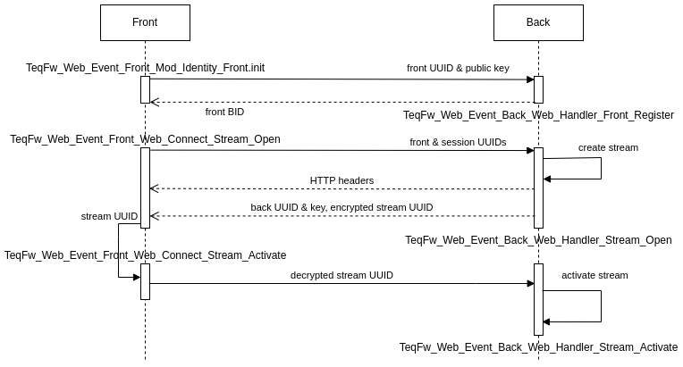

# Transborder events authentication

* Front registration (f => b)
* SSE stream opening (f => b)
* Authentication request (b => f => b)



## Front identity initialization

Launch `TeqFw_Web_Event_Front_Mod_Identity_Front.init` method before any other activities:

```js
export default class Dev_Front_App {
    /**
     * @param {TeqFw_Web_Event_Front_Mod_Identity_Front} modIdentity
     */
    constructor(
        {
            TeqFw_Web_Event_Front_Mod_Identity_Front$: modIdentity,
        }
    ) {
        this.init = async function (fnPrintout) {
            await modIdentity.init();
            // ...
        };
    }
}
```

This method generates new front UUID and keys pair for asymmetric encryption and registers front UUID and public key on
the back. Method uses `TeqFw_Web_Event_Front_Web_Connect_Front_Register` action to send data to backend:

```json
{
  "publicKey": "ISc48bKiSCHwKWC69mb9R85llmZtBZISA2A4hpNG/lg=",
  "frontUuid": "a063fee7-1bdc-45fe-9e4b-76caf87485fa"
}
```

URL: `https://.../web-event-front-reg/frontUuid`

```text
https://wa.com/web-event-front-reg/a063fee7-1bdc-45fe-9e4b-76caf87485fa
```

Backend returns frontBid in response:

```text
738
```

If there is front identity in IDB then stored front identity is used (conflict with backend is possible if backend RDB
was reset).

## SSE stream opening

Action `TeqFw_Web_Event_Front_Web_Connect_Stream_Open.act` is used in the front app:

```js
export default class Dev_Front_App {
    /**
     * @param {TeqFw_Web_Event_Front_Web_Connect_Stream_Open.act|function} connReverseOpen
     */
    constructor(
        {
            TeqFw_Web_Event_Front_Web_Connect_Stream_Open$: connReverseOpen,
        }
    ) {
        this.init = async function (fnPrintout) {
            await modIdentity.init();
            await connReverseOpen();
            // ...
        };
    }
}
```

URL: `https://.../web-event-stream-open/frontUuid/sessionUuid`

```text
https://wa.com/web-event-stream-open/a063fee7-1bdc-45fe-9e4b-76caf87485fa/7b089461-4d03-48ef-8b31-81091ae047d8
```

**Stream opening request is HTTP GET, so it must not be cached by a service worker.**

### Backend handler

SSE opening requests are handled by `TeqFw_Web_Event_Back_Web_Handler_Stream_Open`. It
uses `TeqFw_Web_Event_Back_Web_Handler_Stream_Open_A_Stream.act` action to open stream from backend.
Method `TeqFw_Web_Event_Back_Web_Handler_Stream_Open_A_Stream.act.createStream` creates write-function for the stream,
generates UUID for the stream and registers all data into `TeqFw_Web_Event_Back_Mod_Registry_Stream`.

## Front authentication request

Authentication request is the first request sent from the back to the front through the SSE
channel. `TeqFw_Web_Event_Back_Web_Handler_Stream_Open_A_Stream.act.authenticateStream` does it. Request contains public
key and UUID for backend and new `streamUuid` (encrypted by front's public key):

```json
{
  "backKey": "02SYFvB1A9DV7eS1jbNIpY167w/dkLahX8a8Zk7PEF4=",
  "backUuid": "59450b54-07e5-4359-bf52-8a649cf56804",
  "streamUuidEnc": "NR9...twH"
}
```

### Frontend handler

Authentication request are handled by `TeqFw_Web_Event_Front_Web_Connect_Stream_Open.act.onAuthenticate`. It
decrypts `streamUuid` and sends back to the back using `TeqFw_Web_Event_Front_Web_Connect_Stream_Activate.act`:

```json
{
  "frontUuid": "a063fee7-1bdc-45fe-9e4b-76caf87485fa",
  "streamUuid": "2ca15d2f-ce7b-427f-b41b-ce579df3c9e1"
}
```

URL: `https://.../web-event-stream-act/frontUuid/sessionUuid`

```text
https://wa.com/web-event-stream-act/
```

### Stream activation

Handler `TeqFw_Web_Event_Back_Web_Handler_Stream_Activate` gets decrypted `streamUuid` and activates SSE stream in the
registry.