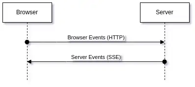

# Transborder events overview

Transborder event is an event where event producer is on one side of web application (front or back) and event consumer
is on the other side (back or front respectively).

IMAGE SHOULD BE HERE

There is a technology to transfer data from front to back - HTTP requests, and there is a technology to transfer data
from back to front - SSE (Server Sent Events). All we need is to combine these technologies - send HTTP requests (POST)
from front to back (if front emits a transborder event or responds to backend event) or send SSE message from back to
front (if back emits a transborder event or responds to frontend event).



## Open SSE connection

There is one problem - the back cannot send SSE messages to the front until the front opens a connection to the back.
So, first of all, the front should open SSE connection to the back and identify yourself:

```js
const url = `${sseHandlerAddress}/${frontId}`;
const source = new EventSource(url);
```

Here `sseHandlerAddress` is an address of the backend handler to process SSE related activity and `frontId` is an
identifier of the front to separates different fronts (one back - many fronts).

## Front identification

If the user opens the same web application in two tabs, two different SSE connections should be opened because the user
can perform different actions in different tabs (can produce different transborder events).
